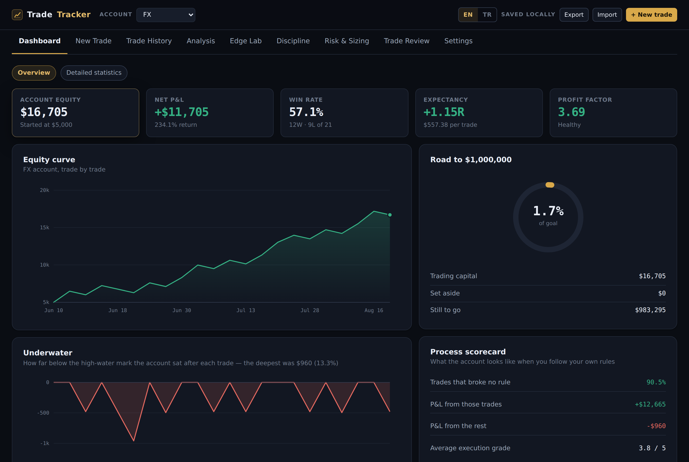

# TradeTracker

A trading journal that scores the process as well as the P&L.

Most journals tell you what you made. This one also tells you what following
your own rules is worth: it flags trades taken outside the plan, redraws the
account without them, and puts a number on the gap.



- **Dashboard** — equity curve, underwater plot, goal progress, weekly and
  monthly bars, and a trading calendar with per-day P&L and weekly totals.
- **Edge Lab** — R-multiple distribution, expectancy, a Monte Carlo that
  resamples your own results to show where the edge leads and what risk per
  trade does to the odds of ruin, session and hour breakdowns, and an MAE/MFE
  scatter showing how much of each move you keep.
- **Discipline** — every trade scored against your own rules (unplanned, taken
  inside the cooldown after a loss, past the daily cap, past the loss limit,
  wrong size), plus the same account redrawn with the flagged trades removed.
- **Risk & Sizing** — position size from entry, stop and risk percentage, with
  contract sizes for forex, gold, indices, stocks and crypto; Kelly from your
  own win rate and payoff, once there are enough trades for it to mean anything.
- **Trade Review** — before/after chart screenshots, the plan you wrote, what
  you actually did, and the one lesson to carry forward.
- English and Turkish. Everything stored locally; no account, no server.

Vanilla HTML, CSS and JavaScript. No framework, no bundler, no package manager,
no network calls at runtime except the Google Fonts stylesheet. The build is a
`cat` of eight files.

```
TradeTracker/
├── build.sh                        concatenates src/ into dist/
├── src/
│   ├── 01-head.html                <title>, fonts, the whole token system + CSS
│   ├── 02-body.html                markup shell: topbar, tabs, view container, modal
│   ├── 02b-lang.js                 tx(), the Turkish dictionary, localized dates
│   ├── 03-core.js                  utilities, trade schema, storage, sample data
│   ├── 04-metrics.js               every calculation the page shows
│   ├── 05-charts.js                hand-drawn SVG charts + the shared hover layer
│   ├── 06-views.js                 one function per tab
│   └── 07-init.js                  event wiring and boot
├── dist/
│   ├── tradetracker.html           standalone — open this one
│   └── tradetracker.embed.html     same page minus the document shell
└── test/
    ├── metrics.test.js             the maths, checked against hand-computed values
    └── backup-roundtrip.test.js    export here, import there, compare byte for byte
```

## Running it

Open `dist/tradetracker.html` in a browser. That is the whole thing.

One caveat: opened straight off disk (`file://`), some browsers refuse to let a
page use local storage, and then nothing survives a reload. The badge in the top
right tells you which state you are in — **Saved locally** means it is saving,
**Not saved** means it is not. If you see *Not saved*, serve the folder instead:

```bash
cd TradeTracker/dist
python3 -m http.server 8000
# then open http://localhost:8000/tradetracker.html
```

Serving it also gives the page a stable origin. A `file://` page has the origin
`null`, which every other file you open off disk shares — so the storage is
technically shared with them. Over http on a fixed port, the journal gets a
private origin of its own.

## Language

English and Turkish, switched by the EN / TR toggle in the top bar or on the
Settings tab. The choice is stored with the settings, so it travels inside a
backup and survives a reload.

Trading vocabulary stays English in both languages — R-multiple, profit factor,
expectancy, drawdown, MAE/MFE, setup names. A Turkish coinage would only have to
be un-learned the moment you read anything else on the subject.

`src/02b-lang.js` holds the whole thing. The translation key **is** the English
string, so a key with no Turkish entry renders as readable English rather than a
blank or a raw identifier — a half-finished translation degrades instead of
breaking. Placeholders are `{named}` and substituted after lookup, which lets a
Turkish sentence reorder them:

```js
tx('{n} trades, {w} win rate, {r} average.', { n: 6, w: '50.0%', r: '+0.94R' })
```

Three things to know if you add strings:

- The function is `tx()`, not `t()` — `t` is the trade variable in half the view
  code, and a shadowed translator fails silently and confusingly.
- `panel()` and `tile()` translate their own title and subtitle, so a static
  label needs no call at the site. Anything built by concatenation does.
- Static markup in `02-body.html` carries `data-t="key"`; `applyStaticLang()`
  walks those after a language change. Month and day names come from
  `monShort()`, `monLong()`, `dayShort()` and `dayInitial()` — the last exists
  because four Turkish weekdays start with P or C, so one letter is not enough
  for the calendar headers.

Numbers stay in en-US format (`$16,705`) in both languages. Turkish digit
grouping beside a `$` sign reads worse than the convention traders already use.

## Storage

Everything is local. The page makes no network call at runtime except the Google
Fonts stylesheet, and there is no account, server or sync.

| What | Where | Why |
|---|---|---|
| Trades, accounts, rules | `localStorage` — keys `tradetracker.trades.v1`, `tradetracker.settings.v1`, `tradetracker.meta.v1` | small, synchronous, trivial to inspect in devtools |
| Screenshots | IndexedDB, database `tradetracker`, store `shots`, keys `<tradeId>:pre` / `<tradeId>:post` | localStorage holds about 5 MB; two JPEGs a trade would fill it inside twenty trades and take the journal down with it |

The trade record keeps only a flag — `shots: { pre: true, post: false }` — and the
image itself is fetched from IndexedDB when the Trade Review tab needs it. The
Review view renders an empty frame and `wireReview()` fills it in, so nothing
waits on a database read.

`Store.probe()` at boot writes and removes a throwaway key to find out whether
local storage works at all. That is what drives the badge, and `Store.persist()`
returns `false` (with a toast naming the reason) when a write is refused, so a
full quota is never silent.

## Backups — and moving to another computer

The backup file is the only way trades reach a second machine. It carries
everything: trades, accounts, rules, setup list, and every screenshot inline.

```jsonc
{
  "app": "tradetracker",
  "format": 2,
  "exportedAt": "2026-09-06T13:04:11.000Z",
  "counts":   { "trades": 42, "screenshots": 12 },
  "checksum": "0d36e24b",          // FNV-1a over {settings, trades, screenshots}
  "settings": { ... },
  "trades":   [ ... ],             // shots as booleans
  "screenshots": { "t7f3:pre": "data:image/jpeg;base64,..." }
}
```

**To copy a journal:** *Export backup* here → open the same page there → *Import
backup* → **Replace everything**. The second machine ends up identical, down to
the trade ids, so a later export from either side stays interchangeable.

Import offers two modes:

- **Replace** wipes what is on this machine first. This is restore-from-backup,
  and the right choice on a fresh machine.
- **Merge** keeps what is here and lays the file on top, matching on trade id.
  Use it when both machines have trades the other lacks. A trade edited in two
  places keeps whichever version was imported last — there is no field-level
  merge and no conflict resolution.

There is no automatic sync in either direction. Pick one machine as the one you
log trades on, or re-export after every session.

The checksum is not security, it is a smoke alarm: if the file was truncated or
hand-edited, the import dialog says so and lets you go ahead anyway.

`format: 1` files — exported before screenshots moved to IndexedDB, when the
image sat inline on the trade — still import; `liftLegacyShots()` pulls the data
URLs out and files them properly.

## Building after a change

```bash
./build.sh                              # rebuilds dist/, syntax-checks the JS
node test/metrics.test.js               # the maths, no browser needed
node test/backup-roundtrip.test.js      # export/import across two browser profiles
```

The round-trip test needs Playwright (`npm i -D playwright && npx playwright
install chromium`). It logs a trade and a screenshot in one browser profile,
exports, imports into a second clean profile, and checks that the ids, the
numbers and the image bytes all match. If you change the backup format, that is
the test that has to stay green.

`dist/tradetracker.embed.html` is the same page with no `<!doctype>`, `<html>`,
`<head>` or `<body>` of its own, for dropping into a host page that supplies
those. Behaviour is identical; each copy keeps its own journal, because each
origin has its own storage.

## How it fits together

**One render function.** `render()` in `07-init.js` clears the chart queue, calls
the current view function, writes the returned HTML string into `#view`, then
paints the charts and attaches the view's handlers. There is no virtual DOM and
no reactivity — every state change re-renders the whole view. At this data size
that is cheaper than the machinery to avoid it. Two places update in place
instead, because re-rendering would interrupt typing: the position-size
calculator and the live R-multiple readout on the trade form.

**Views return strings; metrics do the thinking.** Nothing in `06-views.js`
calculates anything. It reads from `metrics()`, `group()`, `disciplineReport()`
and friends in `04-metrics.js` and formats. If a number looks wrong, it is wrong
in `04-metrics.js`, and `test/metrics.test.js` covers it.

**Charts render at their container's pixel width.** A view calls
`slot('chartBars', [data], opts)`, which reserves an empty div and queues the
call. After the HTML is in the DOM, `paintCharts()` measures each slot and draws
the SVG with `viewBox` set to that exact width — so 11px axis type is 11px in a
wide panel and in a narrow one. Scaling one fixed viewBox instead would shrink
the labels in half-width panels to about 4px, which was the first version and
was unreadable.

**Storage is local and synchronous.** `Store` is a plain object over
`localStorage`; every mutation calls `persist()`, which rewrites all three keys.
At this size rewriting beats tracking dirty records. `Shots` is the one async
part, and only the Review tab touches it.

**Sample data is never stored.** `demoTrades()` builds 26 invented trades in
memory when the store is empty, so the page opens showing what it does rather
than an empty shell. The first real trade you log clears them; so does the button
on the banner. `persist()` returns early while `demo` is true, so they never
reach disk.

## The data model

One trade, as stored:

```js
{
  id, account,                      // which account it belongs to
  symbol, symbolType, direction,    // XAUUSD, XAU, long
  entryAt, exitAt,                  // local ISO, minute precision
  entry, stop, target, exit, size,
  risk,                             // cash you accepted losing — the R denominator
  pnl, outcome,
  setup, tags: [],
  maeR, mfeR,                       // worst / best excursion, in R (null = not logged)
  planned,                          // was it in the plan before the session
  adherence: { entry, stop, target, sizing, rules },   // booleans
  context, emotion, quality,        // read, mood, 1-5 execution grade
  analysis, plan, setupNotes, execReview, reflection, lesson,
  shots: { pre, post },             // booleans — the images live in IndexedDB
  createdAt, updatedAt
}
```

`risk` is the field everything else leans on. R-multiple is `pnl / risk`, and
expectancy, the histogram, the Monte Carlo and the discipline report are all
built on R. A trade logged without `risk` contributes 0R and quietly flattens
those numbers, which is why the form marks it required.

Screenshots are downscaled to 1100px wide and compressed until each fits about
110KB, then written to IndexedDB under `<tradeId>:pre` / `<tradeId>:post`.
Deleting a trade deletes its images with it.

## What the less obvious numbers mean

**Expectancy** — the average R across every trade. The single most useful number
here: at +0.4R, a hundred trades at $500 risk is worth about $20,000, and nothing
about win rate changes that.

**Profit factor** — gross won ÷ gross lost. Below 1.0 the account is going down.

**Consistency** (`stability`) — average R ÷ the standard deviation of R. Two
systems with the same expectancy are not equally comfortable to trade; this is
the difference.

**System quality** (`sqn`) — consistency × √n. Rises as the sample grows, so it
says "this edge looks real" rather than "this edge is big". Under about 30 trades
it means little.

**Capture rate** — for winners with an MFE logged, realised R ÷ best-point R.
86% means you keep most of what the trade offers; 40% means the exit is the
thing to work on, not the entry.

**Discipline flags** — a trade is flagged when it was unplanned, taken inside the
cooldown window after a loss, past the daily trade cap, past the daily loss
limit, or sized wrong. The panel then redraws the same account with the flagged
trades removed. The gap between those two curves is the cheapest money in the
whole app: it needs no new edge, only doing what you already decided to do.

**Monte Carlo** — resamples your own R-multiples with replacement, 1,500 paths,
compounding at a fixed fraction of equity. It is your past reshuffled, not a
forecast, and it inherits every bias in the sample. Its honest use is comparative:
set risk to 1%, then to 5%, and watch the ruin probability move.

## Adding to it

**A new tab.** Write `viewThing()` in `06-views.js` returning an HTML string, add
`thing: viewThing` to `VIEWS` at the bottom of that file, and add a
`<button class="tab" data-view="thing">` in `02-body.html`. If it needs handlers,
add `if (App.view === 'thing') wireThing();` inside `wireView()`.

**A new metric.** Add it to the object `metrics()` returns, add a case to
`test/metrics.test.js`, then read it in a view.

**A new discipline rule.** Push a `{id, label}` into the flags array in
`disciplineFlags()`. Everything downstream — the counts, the cost breakdown, the
what-if curve, the flag pills in the trade table — picks it up automatically.

**A new chart.** Write a function taking `(data, opt)` that returns
`wrap(svgContent, height, VW)`, with `const VW = o.vw || 1000` at the top so it
honours the measured width, then register it in the `Object.assign(CHART_FNS, …)`
call. Give any hoverable mark `data-tip`, `data-cx` and `data-cy` and the shared
hover layer handles the tooltip.

**Colours.** Everything comes from the CSS custom properties at the top of
`01-head.html`. They are declared three times — once bare for light, once under
`prefers-color-scheme: dark`, once under `[data-theme="dark"]` — so both themes
and the explicit toggle all resolve. Add a token to all three or it will be
undefined in one of them.

## Licence

MIT — see [LICENSE](LICENSE).
